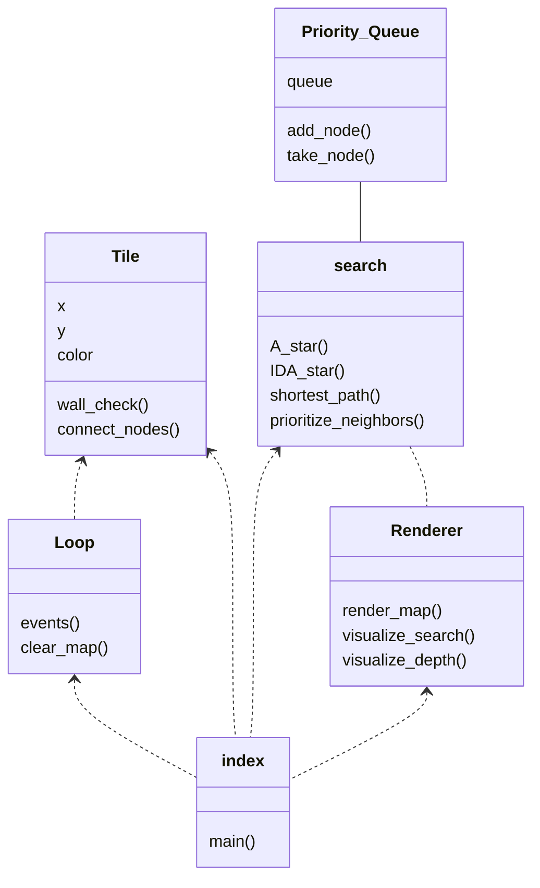

# Implementation document
## Project structure

## Complexity and performance
Both A* and IDA* -algorithm use heuristics in path finding. They choose the order in which to traverse the map based on the smallest f(n) value, where f(n) = h(n) + g(n), and h(n) is the node's heuristic(euclidian distance to the goal) and g(n) is the cost of travel to the node.
Where the algorithms differ is their memory use. A* uses best-first search and stores every visited node in a tree, which it will use to traverse back to the starting node once the end node is reached. IDA* doesn't store visited nodes, it uses iterative depth-first search in firnding the
shortest path, which means that it will search the same nodes again while trying out different routes, and then increase the search limit every iteration. While IDA* saves on memory and can find the shortest path faster than A* in smaller and simple pixel maps, it's time complexity increases
significantly when there are more nodes to search. In a bigger or more complex map, A* won't needlessly search nodes that it has already visited.

The time complexity depends a lot on the heuristics used in the search. If the heuristic is not fitting for the map, it will increase the time complexity of the search algorithm. As for space complexity, for A* in the worst-case scenario the space complexity is O(b^d), where b is the average number of branching nodes from a tile on the map, and d is the number of nodes on the shortest path.
For IDA*, the space complexity is O(bd), since it doesn't have to remember visited nodes.

While IDA* can be used on a pixel map like in this project, it works better in a network which has less nodes. A* works on pixel maps pretty well, but it can take a lot of space and memory in a bigger map.

### Sources:
- https://en.wikipedia.org/wiki/A*_search_algorithm
- https://en.wikipedia.org/wiki/Iterative_deepening_A*
- https://www.baeldung.com/cs/a-star-algorithm
